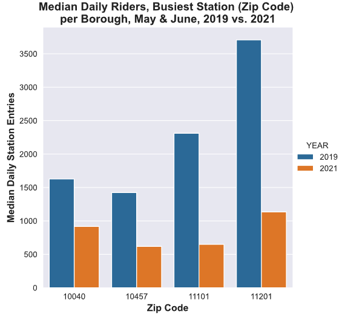
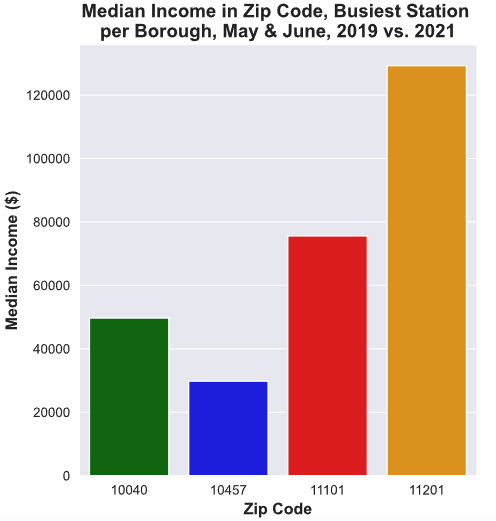
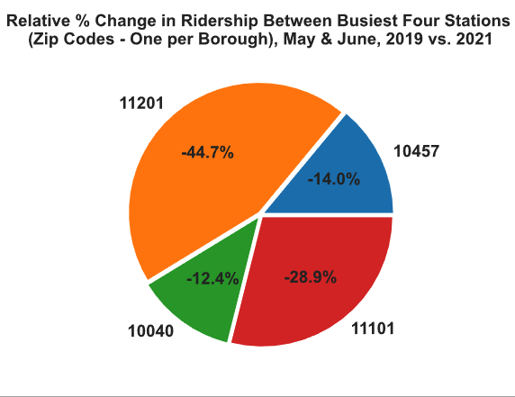
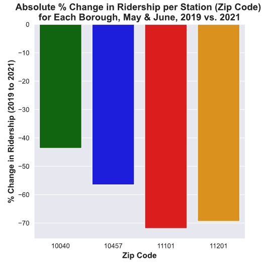

# Minimum Viable Product

#### Exploration of MTA Subway Level of Ridership Changes pre-vs-post-COVID-19 Pandemic

The goal of this poject is to identify any decline in ridership during the post-pandemic timeframe (May and June of 2021) relative to pre-pandemic (May and June of 2020). For any such declines observed, the study will highlight demographic patterns associated with neighborhoods (stations)  which may correlate with degree of change in ridership. MTA will ultimately use this information to launch a targeted marketing outreach campaign aimed at winning back lost riders in the most impacted areas.

|  |  |
| ------------------------------------------------------------ | ------------------------------------------------------------ |
|  |  |

The plots above illustrate the general nature of the study's results. In this example, each borough's busiest station for May - June 2019 (as defined by the two-month median of daily entries into the station - a proxy for ridership during this period) has been identified. (Recall that Staten Island has no subway stations and will thus be ignored.) Each of the four stations lies in one of the postal zip codes shown, and the first figure (upper left) clearly demonstrates a significant decline in ridership across all stations during May - June 2021. 

The second plot (upper right) shows the median annual household incomes for these four zip codes (as determined from US Census Bureau data). If all four zip codes had experienced a completely proportional loss of riders relative to the other three, the pie chart (lower left) would show a relative change of -25% from 2019 to 2021 for every station. But this chart indicates that the zip codes linked with the two highest annual incomes exhibit considerably larger relative declines in combined 2021 ridership compared to the two zip codes associated with lower annual incomes.

The fourth plot (lower right) shows the absolute percentage decline in ridership for a given station between 2019 and 2021. As clearly seen, the highest income zip code stations lost roughly 70% of their 2019 ridership, while the other two stations saw more modest declines of around 45-55%. It would seem that annual income may play a non-trivial role in whether or not someone chooses to ride the subway in 2021. This may have to do with having the finances to find alternative transportation, or it could be that higher incomes correlate with the luxury of working from home in the post-pandemic economy, removing the need to use the subway system on a daily basis.

Additional plots in the final report will look at other zip codes (specifically chosen by demographic factors such as annual income) as well as presenting borough-level aggregations. Furthermore, the dataset has been flagged for weekend versus weekday information, making it possible to compare traditional work-week ridership with weekend (presumably more leisure-oriented) ridership numbers, so these relationships will also be explored.

